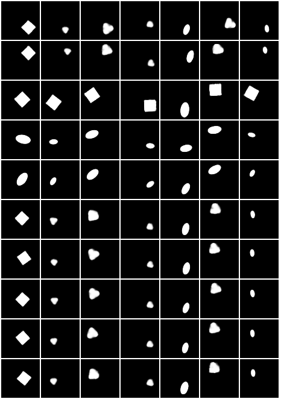

# Turning Normalizing Flows into Monge Maps with Geodesic Gaussian Preserving Flows 
<p align="center">
  
</p> 
 
This repository contains the code from the article [Turning Normalizing Flows into Monge Maps with Geodesic Gaussian Preserving Flows](https://arxiv.org/abs/2209.10873).

## Run

Use `python main.py <param>` to train a normalizing flow (NF) or a Gaussian preserving (GP) flow on a pretrained model. You can run predefined hyper-parameters using `--default_params`. 

Package

### Two dimensional case

For example to train BNAF model on the eight gaussians test case:

```
python main.py --default_params --data_type eight_gaussians --opt_type train_nf --nf_model bnaf
```

Choose `--opt_type train_gp` to train a GP flow on a pretrained model. For example:

```
python main.py --default_params --data_type eight_gaussians --opt_type train_gp --model_path pretrained_models/eight_gaussians/bnaf --gpu 0
```

Finally to train GP flows with Euler penalization on the moons dataset run

```
python main.py --default_params --data_type moons --opt_type train_gp --model_path pretrained_models/moons/bnaf --gpu 0 --use_euler --euler_case penalization
```

### dSprites dataset

A pretrained FFJORD model is given for the dSprites dataset. To train a GP flow on it run

```
python main.py --default_params --data_type dsprites --model_path "pretrained_models/dsprites/ffjord/" --opt_type train_gp --gpu 0
```

## Dependencies

To install necessary python packages for the code run

```
pip install -r requirements.txt
```

## Help

```
usage: main.py ...

Train data with a normalizing flow or GP flow.

options:
  -h, --help                            show this help message and exit

General options:
  -dat, --data_type {eight_gaussians,moons,dsprites,mnist,chairs,celeba}
                                        Data type
  -o, --opt_type {train_nf,train_gp}    Either train a normalizing flow or GP
                                        flow on a pre-trained model.
  -ns, --nb_samples                     How many samples in 2d or when training
                                        GP on gaussian noise.
  --default_params                      Restore training from previous
                                        checkpoint.
  -d, --dim                             Dimension.
  -e, --epochs                          Number of epochs.
  -bs, --batch_size                     Batch size.
  -lr, --learning_rate                  Learning rate.
  --nb_decay_lr                         Number of time where the learning rate
                                        is periodically dividedby 2 during
                                        training.
  --check_val_every_n_epochs            Check validation every n epochs.
  -gpu, --gpu                           GPU id used, -1 for CPU.
  --restore_training                    Restore training from previous
                                        checkpoint.
  --ckpt_path CKPT_PATH                 Chekpoint path.
  --nf_model {ffjord,bnaf,cpflow}       The NF model used.

GP flow:
  --model_path                          Path to the pre-trained model.
  -nl_gp, --nb_layers_gp                How many time steps. Default to 15.
  -nn_gp, --nb_neurons_gp  [ ...]       Number of neurons for each hidden layer
                                        in the velocity.
  -ndb_gp, --nb_div_blocks_gp           Number of div blocks. Should be d-1 to
                                        have all the divergence free functions.
  --data_case_gp {train_gp_on_gaussian_noise,train_gp_on_data}
                                        To train GP flow on data or gaussian
                                        nois (only if backward function is
                                        available for the model).
  --reload_dataloaders_every_n_epochs   Reload data every n rpochs. Only when
                                        training GP flow with gaussian noise.
  --use_euler                           Use euler.
  --euler_case {penalization,spectral_method}
                                        Method to solve Euler's equations
                                        (spectral method works only in 2d).
  --euler_coef                          Coefficient for Euler's penalization.
  --nb_decay_euler_coef                 Number of times where Euler's
                                        coefficient is divided periodically by 2
                                        during the training.
```

## Outputs

The outputs will be saved in `outputs/tensorboard_logs/version_<number>`. 

- The losses as well are other useful informations can be visualized with tensorboard

```
tensorboard --logdir=outputs/tensorboard_logs/version_<number>
```

- The images can be generated with `python main_viz.py --ckpt_path "path/to/chekpoint"`

## Additional examples

Here are additional animations of some examples presented in the paper.

### Euler's regularization in 2d

GP flows obtained by reducing the OT cost of the BNAF model trained on the two moons test case. From left to right: no regularization, penalization of Euler's equation with the method presented in the paper and solution obtained by optimizing directly through a spectral method (polynomial of degree 9): 
  
  | GP no regularization   |  GP + Euler penalization | GP + Euler spectral|
  |:-------------------------:|:----------------:|:--------:|
  |  |  | | 
| |  |  |

<!--
<p align="center">
  
      
   
</p> 
-->

### Improving disentanglement preservation with optimal transport

Some animations of disentaglement preservation on the [dSprites](https://github.com/deepmind/dsprites-dataset/), [MNIST](http://yann.lecun.com/exdb/mnist/) and [chairs](https://www.di.ens.fr/willow/research/seeing3Dchairs/) datasets are presented. Each of the row correspond to interpolations along one axis. The dimensions are sorted with respect to their KL divergence in the VAE latent space, so the higher rows carry more information while the last rows should leave the image unchanged.


  |Initial latent space       |  FFJORD | FFJORD + GP + Euler|
  |:-------------------------:|:----------------:|:--------:|
  | |  | |
 
 |Initial latent space       |  FFJORD | FFJORD + GP|
  |:-------------------------:|:----------------:|:--------:|
   | |  | | 
  
  |Initial latent space       |  FFJORD | FFJORD + GP + Euler|
  |:-------------------------:|:----------------:|:--------:|
  | |  | | 
   
 ## Many thanks
 
 The code for the [FFJORD](https://github.com/rtqichen/ffjord/), [BNAF](https://github.com/nicola-decao/BNAF/) and [CPFlows](https://github.com/CW-Huang/CP-Flow/) models have been taken from the official repositories.
 
 The great disentanglement library comes from [Yann Dubois](https://github.com/YannDubs/disentangling-vae) github repository.
 
 This work has been founded by the [IMT Atlantique](https://www.imt-atlantique.fr/en) and the labex [CominLabs](https://cominlabs.inria.fr).
